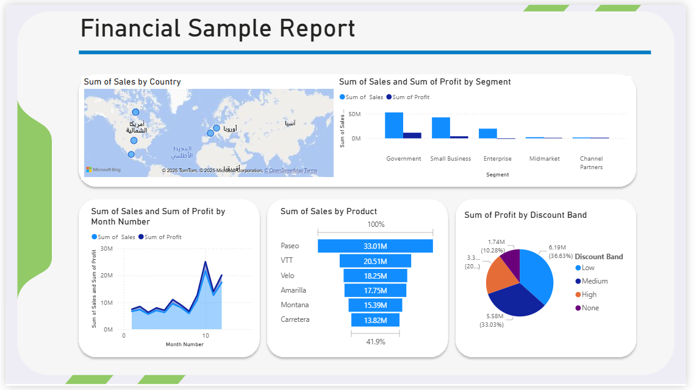

Financial Sample Report
This repository contains a financial sample dataset and an interactive Power BI report that visualizes and analyzes key business metrics.

📁 Files
Financial Sample.xlsx
Raw dataset containing sales data categorized by:

Country

Product

Segment

Discount Band

Units Sold

Sales and Profit

Dates

FinancialSampleOnlineReport.pbix
Power BI Desktop report that transforms the data into meaningful, interactive visual insights.

📊 Features
Sales and Profit Analysis
By country, segment, product, and time period.

Dynamic Visualizations

Map visualization for regional sales

Bar charts for sales/profit by segment and product

Line charts for monthly trends

Pie charts for discount band profitability

Filters & Slicers
Quickly focus on specific data segments through slicers.

KPIs
Track performance with key financial indicators.

#PowerBI #DataVisualization #FinancialAnalysis #BusinessIntelligence
